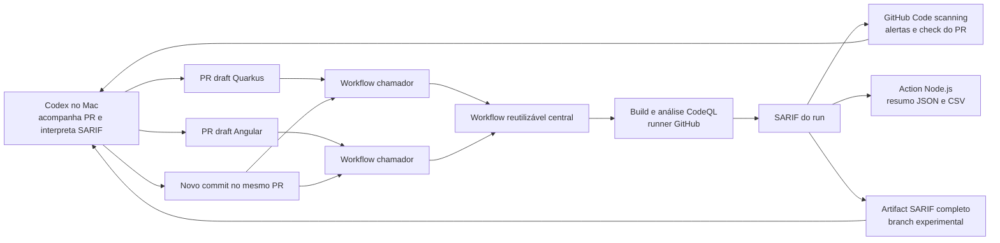

# Arquitetura executada no laboratório

Os forks chamaram o workflow central por SHA. Quarkus usou build Maven e CodeQL Java/Kotlin; Angular usou npm e CodeQL JavaScript/TypeScript. O CodeQL publicou o resultado em Code scanning; a action Node.js produziu resumo e aplicou modos experimentais. O SARIF integral tornou-se baixável na branch central `poc/sarif-artifact` (commit [`836fab4`](https://github.com/DavidFaustino/ssdlc-codeql-poc/commit/836fab41ce4b2153abc90ada9cd5a4e50764924a)), **não em `main`**. A publicação integral ocorreu antes da avaliação customizada, para preservar o artifact mesmo quando o job falhava intencionalmente.

No PR, `head SHA`, merge ref (`refs/pull/N/merge`) e SHA da análise não são necessariamente iguais. Codex conferiu a execução correspondente antes de usar o SARIF para correção. Um alerta histórico `fixed` ou um artifact de run antigo não representa o estado do commit atual.

O Ruleset nativo foi um experimento separado no Angular: com o workflow customizado em `observe`, o job ficou verde, mas o check nativo de CodeQL falhou com achado High e bloqueou o merge. Após a correção, o check passou. Esse caminho **não passou** pela action de política customizada.

Não houve integração com Devin, DefectDojo, gate de release ou deploy. O desenho desses caminhos pertence ao [Piloto P](../piloto-p/README.md) ou a estudos posteriores, não à arquitetura executada acima.
